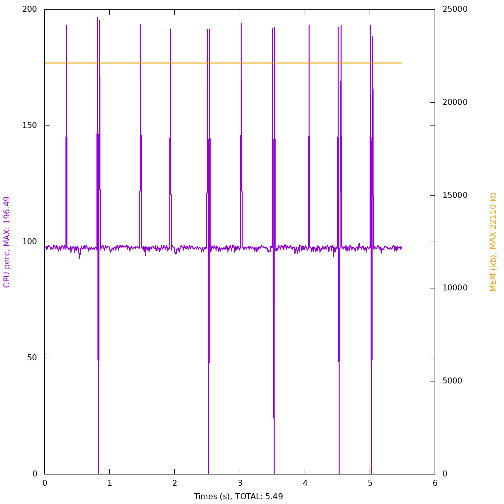
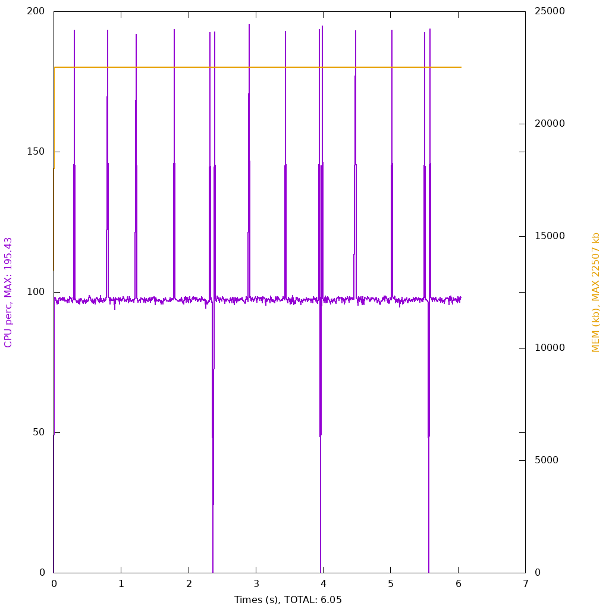

## Concatenation strategies

### Explanation

When you want to combine multiple strings together.

## Sprintf 



```php 

<?php
$variableA = "String A";
$variableB = 12345;
$variableC = "String C";

$iterations = $argv[1] ?? 1000000; // 1 million.

for ($i = 0; $i < $iterations; $i++) {
    $_ = sprintf("a: %s | b: %d | c: %s", $variableA, $variableB, $variableC);
}

assert($_ = "a: string a | b: 12345 | c: string b");

```

## Inline 


```php 

<?php
$variableA = "String A";
$variableB = 12345;
$variableC = "String C";

$iterations = $argv[1] ?? 1000000;

for ($i = 0; $i < $iterations; $i++) {
    $_ = "a: $variableA | b: $variableB | c: $variableC";
}

assert($_ = "a: string a | b: 12345 | c: string b");

```

## Array 


```php 

<?php

$variableA = "string A";
$variableB = 12345;
$variableC = "String C";

$data = [
    'a:',
    $variableA,
    '| b:',
    $variableB,
    '| c:',
    $variableC,
];

$iterations = $argv[1] ?? 1000000;

for ($i = 0; $i < $iterations; $i++) {
    $_ = implode(' ', $data);
}

assert($_ = "a: string A | b: 12345 | c: string B");

```

## Concat 



```php 

<?php
$variableA = "String A";
$variableB = 12345;
$variableC = "String C";

$iterations = $argv[1] ?? 1000000;

for ($i = 0; $i < $iterations; $i++) {
    $_ = 'a: '. $variableA . ' | b: '.$variableB.' | c: '.$variableC;
}

assert($_ = "a: string A | b: 12345 | c: string B");

```
