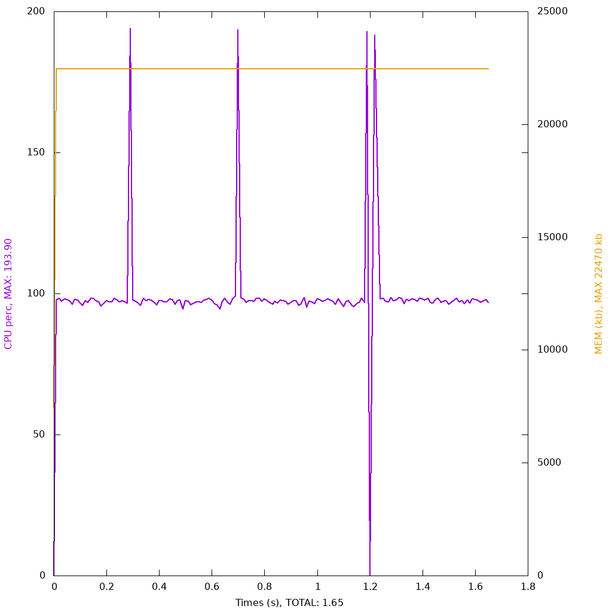
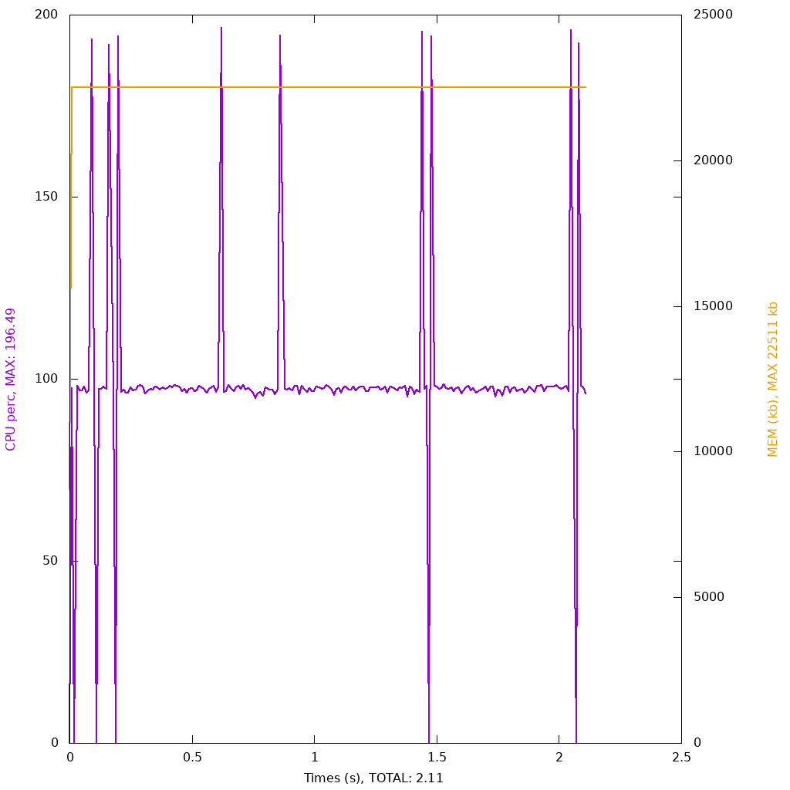

## Use function in namespace

### Explanation

In a [presentation](https://www.youtube.com/watch?v=JBWgvUrb-q8) by Nikita Popov,
he mentions that when you are in a namespaced scope, it might be more performant
to use functions in use statements or specify its namespace than to just write
it out.

## With use 



```php 

<?php

namespace Foo;

$array = [1, 2, 3];

$iterations = $argv[1] ?? 1000000;

for ($i = 0; $i < $iterations; $i++) {
    $_ = \count($array);
}

```

## Without use 



```php 

<?php

namespace Foo;

$array = [1, 2, 3];

$iterations = $argv[1] ?? 1000000;

for ($i = 0; $i < $iterations; $i++) {
    $_ = count($array);
}

```
