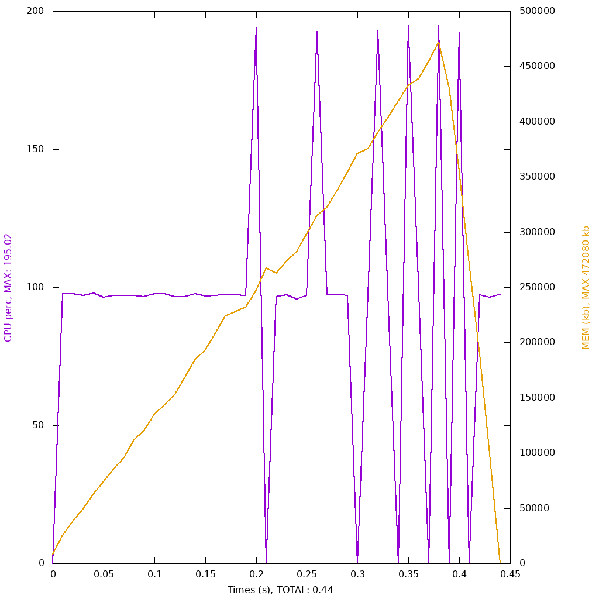

## Objects vs arrays

NOTE: This test runs its own set of iterations
and is not using the number from the make file.

It would run out of memory pretty
quickly with that amount of iterations.

### Explanation

To identify if a php object is more or less memory heavy than an array.

To do this we make a small function.

We instantiate a array or object, take a specific value from it and assign it to another part of the object or array.

Then we return that and assign it to $$i to keep it in memory for all the iterations.

## Objects 


```php 

<?php

class MyStruct
{
    public $variableA;
    public $variableB;
    public $variableC;

    public function __construct($variableA, $variableB, $variableC)
    {
        $this->variableA = $variableA;
        $this->variableB = $variableB;
        $this->variableC = $variableC;
    }
}

function test()
{
    // Instantiate.
    $object = new MyStruct('String A', 12345, 'String B');

    // Act on it.
    $object->variableA = $object->variableC;
    $object->variableC = "Some new value";

    return $object;
}

$iterations = 1000000;

for ($i = 0; $i < $iterations; $i++) {
    $$i = test();
}

```

## Array 



```php 

<?php

function test()
{
    // Instantiate.
    $array = [];
    $array['variableA'] = 'String A';
    $array['variableB'] = 12345;
    $array['variableC'] = 'String B';

    // Act on it.
    $array['variableA'] = $array['variableC'];
    $array['variableC'] = "Some new value";

    return $array;
}

$iterations = 1000000;

for ($i = 0; $i < $iterations; $i++) {
    $$i = test();
}

```

## Objects type hinted 


```php 

<?php

class MyStruct
{
    public string $variableA;
    public int $variableB;
    public string $variableC;

    public function __construct(string $variableA, int $variableB, string $variableC)
    {
        $this->variableA = $variableA;
        $this->variableB = $variableB;
        $this->variableC = $variableC;
    }
}

function test(): MyStruct
{
    // Instantiate.
    $object = new MyStruct('String A', 12345, 'String B');

    // Act on it.
    $object->variableA = $object->variableC;
    $object->variableC = "Some new value";

    return $object;
}

$iterations = 1000000;

for ($i = 0; $i < $iterations; $i++) {
    $$i = test();
}

```
